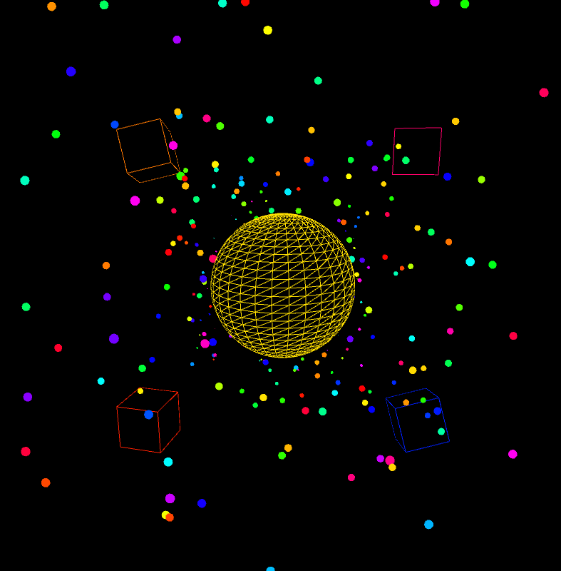

# Music Visualiser Project

Name: Sara Egan, Milosz Lewandowski, Sabrina Boc

Student Number: C20353056, C20355901, C20394813

## Instructions
- Fork this repository and use it a starter project for your assignment
- Create a new package named your student number and put all your code in this package.
- You should start by creating a subclass of ie.tudublin.Visual
- There is an example visualiser called MyVisual in the example package
- Check out the WaveForm and AudioBandsVisual for examples of how to call the Processing functions from other classes that are not subclasses of PApplet

# Description of the assignment
Our assignment is a audio visual representation of the song Andromeda by Gorillaz.

# Instructions
Our assignment uses switch cases. We have 3 visuals in total and you use the 1-3 keys to cycle through our visuals. The first visual we let run though the first trimester of the song, and the second visual is for the chorus. The the third visual for the final section of the song. Once you run the program the first case visual and song will automatically start. 
Press space bar to pause and resume the music. 

# How it works
When the program is initially run, the music file "andromeda.mp3" starts playing and our case 1 visual begins to render on the screen. This is done by utilising the packages  ``` dd.minim.AudioBuffer``` and ```dff.minim.AudioInput``` to process the mp3 file containing the music.

For the visuals, built-in methods from ```processing.core.PApplet``` was utilised to create objects to be displayed on the canvas.  
In our first case visual, we utilised the ```pushMatrix();``` and ```popMatrix()```. These two methods were used to create a 3D-effect for when objects were drawn on the canvas. It allowed layering of visual objects on screen, and so we could translate a visual to move behind and forwards of a stationary visual, i.e.

```Java
	float wave = sin(radians(frameCount));
    calculateAverageAmplitude();
    float daddy = 50 + (200 * getSmoothedAmplitude());
```
The variable wave is used to track the framerate and move the visual in-sync with the frames. "daddy" is used as a placeholder for a smoothed amplitude, so when the visual is rendered, it does not look like it is 'glitching' or 'lagging' as the object visual is being translated across the screenn/canvas.

```Java
 	rotateX(wave);
    rotateY(wave);
    sphere(100);
```
Here is the line visuals for the drawing of a sphere. The visual dictates that the sphere rotates on both its X and Y axis and rotates accordingly to the framerate of the canvas, and  to 


```Java
	pushMatrix();
	lights();
	stroke(random(0, 255), 255, 255);
	fill(0);
	translate(200, 200, wave * 200);
	rotate(wave);
	box(daddy);
	popMatrix();
```
Here, when creating a visual object that moves and reacts to the music/audio, we've utilised the matrix stack by putting in ```pushMatrix()``` and ```popMatrix()```. This is done to prevent other objects on the canvas to be transformed alongside the targeted visual; in this instance, being a box visual that rotates on a given axis and moves across the screen (an object created for all 4 corners of the screen).
```lights()`` is used to create ambient lighting on the object when visualised. This adds depth to the drawing, and is only used for visual aesthetic.

The use of ```pushMatrix()``` and ```popMatrix()``` are more prevalent when we see the Star.java visual being called and rendered in the background of the case 1 visual. This Star.java visual runs in the background, and stays stationary behind the 3D sphere. 

```Java
	pushMatrix();
	lights();
	stroke(random(0, 255), 255, 255);
	fill(0);
	translate(200, 200, wave * 200);
	rotate(wave);
	box(daddy);
	popMatrix();
```


# What I am most proud of in the assignment
Our proudest moment was creating code that resembles the feeling of the music. There is a real out of space melody to the song so we decided to recreate the feeling of falling through space with our 1st visual. We had many errors in the initial development of our star warp background but after many failed attempts we made a successful version where there is a perception of the stars coming from the middle of the screen.


The websites and videos we used to support our visual creations are below:

- [Processing.org](https://processing.org/)
- [The coding train](https://www.youtube.com/watch?v=17WoOqgXsRM&list=PLfdtKB2pINRFTQQcExU8JOOd6CuZ3Q2U9&index=2)


This is an image using a relative URL:



This is an image using an absolute URL:


This is our vimeo video as we were unable to post to Youtube due to copyright:

- [Vimeo link](https://vimeo.com/707030173)

